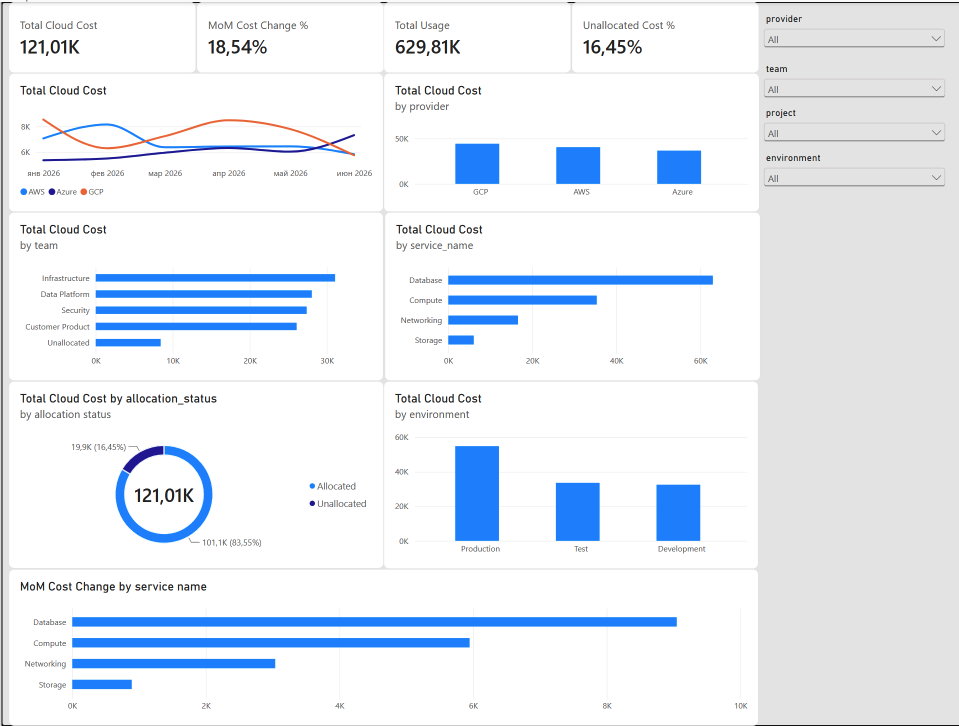

# Cloud Cost Intelligence Data Platform

## Business problem

Cloud-cost data is often distributed across billing exports, accounts,
subscriptions, services and engineering teams. This makes it difficult for
finance and engineering leaders to understand what is driving expenditure,
identify unexpected changes and assign costs to accountable teams.

## Project goal

Build an end-to-end analytics platform that ingests simulated cloud billing
data, validates and transforms it through Bronze, Silver and Gold layers,
and exposes decision-ready cloud-cost metrics in Power BI.

## Target users

- FinOps analysts
- Engineering managers
- Finance business partners
- Technology leadership

## MVP analytical questions

1. What is the total cloud cost by month?
2. Which teams, projects and services generate the highest costs?
3. How does actual monthly cost compare with the previous month?
4. Which cost categories show unusually large increases?
5. What proportion of spending can be allocated to a team or project?

## Tech stack

- Python
- Databricks
- PySpark
- Delta Lake
- Unity Catalog
- dbt
- SQL
- Power BI
- Git / GitHub

## Architecture

```text
Synthetic AWS / Azure / GCP billing data
                ↓
          Python generator
                ↓
      Databricks + Delta Lake
                ↓
             Bronze
      raw records + metadata
                ↓
             Silver
 cleaning + standardization + dedupe
                ↓
              dbt
     source → staging → tests
                ↓
   fct_monthly_cloud_costs
            Gold mart
                ↓
            Power BI
```

## Layer responsibilities

**Python**  
Synthetic multi-cloud billing generation.

**Databricks / PySpark**  
Data ingestion, Bronze and Silver transformations.

**Delta Lake / Unity Catalog**  
Storage and governed data objects.

**dbt**  
Analytics modeling, testing, lineage and documentation.

**Power BI**  
FinOps reporting and consumption layer.

## Data Quality

The dbt layer validates core analytical assumptions before
building the reporting mart.

Current checks include:

- required billing dates
- valid cloud providers
- required service names
- non-null cost values
- accepted environment values
- required allocation status

## Gold Analytical model

The main reporting mart is:

fct_monthly_cloud_costs

It aggregates cloud-cost data by:

- billing month
- cloud provider
- team
- project
- service
- environment
- allocation status

The model includes core reporting measures such as:

- total cost
- total usage
- usage record count
- resource count

The dbt Gold model is used as the canonical analytical layer for downstream
reporting.

An earlier PySpark Gold implementation is retained as a validation benchmark
and is reconciled against the dbt model to confirm consistency of total costs.


## Pipeline status

- ✅ Synthetic cloud cost generation
- ✅ Bronze ingestion and metadata
- ✅ Silver cleaning and standardization
- ✅ Duplicate and allocation handling
- ✅ dbt staging model
- ✅ dbt data quality tests
- ✅ Gold monthly cost mart
- ✅ Silver-to-Gold cost reconciliation
- ✅ dbt documentation and lineage metadata
- ✅ Power BI dashboard

## Dashboard

The Power BI dashboard provides a business-facing view of multi-cloud expenditure
with a focus on cost visibility, ownership, allocation and month-over-month trends.

The dashboard includes:

- Total Cloud Cost
- Month-over-Month Cost Change %
- Total Usage
- Unallocated Cost %
- Monthly cloud cost trend
- Cost by cloud provider
- Cost by team
- Cost by service
- Cost by environment
- Allocated vs unallocated spend
- Top month-over-month cost increase drivers
- Interactive filters for month, provider, team, project and environment

### Dashboard preview



## Key insights

- GCP represents the largest share of total simulated cloud spend.
- Infrastructure is the highest-cost engineering team in the selected period.
- Database shows the largest month-over-month cost increase.
- Production workloads account for the majority of total cloud expenditure.
- 16% of spending remains unallocated to a team or project.

## Repository structure

```text
cloud-cost-intelligence-platform/
├── dbt/
│   └── cloud_cost_intelligence/
│       ├── models/
│       │   ├── staging/
│       │   │   ├── sources.yml
│       │   │   ├── stg_cloud_costs.sql
│       │   │   └── stg_cloud_costs.yml
│       │   └── marts/
│       │       ├── fct_monthly_cloud_costs.sql
│       │       └── fct_monthly_cloud_costs.yml
│       └── dbt_project.yml
├── docs/
│   └── data_contract.md
├── notebooks/
│   └── Databricks transformation notebooks
├── src/
│   └── synthetic data generation
├── powerbi/
│   ├── cloud_cost_project.pbix
│   └── cloud_cost_intelligence.png
└── README.md
```

## Current project scope

The current version focuses on a clear end-to-end analytical flow:

1. Generate realistic synthetic multi-cloud billing data.
2. Load raw records into the Bronze layer.
3. Clean, standardize and deduplicate records in Silver.
4. Apply allocation and data-quality logic.
5. Expose Silver data to dbt as a source.
6. Build a tested analytical Gold mart in dbt.
7. Reconcile Gold outputs for consistency.
8. Consume the Gold mart in Power BI.

The goal of the project is not to reproduce a complete enterprise FinOps
platform, but to demonstrate a production-oriented analytics workflow with
clear separation between ingestion, transformation, testing, analytical
modeling and BI consumption.
